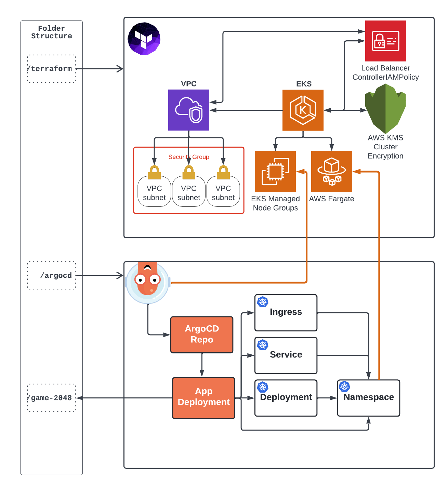

# Architecture



# Prerequisites
```bash
AWS CLI
eksctl
kubectl
helm
ArgoCD CLI
```

# Terraform

```bash
❯ cd terraform/
❯ tf init
❯ tf apply
❯ cd ../.
```

# Generate Kubeconfig
```bash
❯ export AWS_EKS_CLUSTER_NAME=loftlabeks # Replace with your cluster name
❯ export AWS_DEFAULT_REGION=eu-central-1 # Set the correct region (for aws cli & eksctl)
❯ aws eks update-kubeconfig --region eu-central-1 --name $AWS_EKS_CLUSTER_NAME
```

## Verify its working

```bash
❯ kubectl get nodes
NAME                                          STATUS   ROLES    AGE   VERSION
ip-10-0-1-166.eu-central-1.compute.internal   Ready    <none>   23m   v1.21.5-eks-9017834
ip-10-0-2-126.eu-central-1.compute.internal   Ready    <none>   23m   v1.21.5-eks-9017834
ip-10-0-3-169.eu-central-1.compute.internal   Ready    <none>   23m   v1.21.5-eks-9017834
```

# Apply Loadbalancer Pre-Requirements

## Get AWS Account ID
```bash
# Make sure $AWS_EKS_CLUSTER_NAME is set
❯ export AWS_ACCOUNT_ID=`aws sts get-caller-identity --query Account --output text`
```

```bash
❯ eksctl create iamserviceaccount \
  --cluster=$AWS_EKS_CLUSTER_NAME \
  --namespace=kube-system \
  --name=aws-load-balancer-controller \
  --role-name "AmazonEKSLoadBalancerControllerRole" \
  --attach-policy-arn arn:aws:iam::${AWS_ACCOUNT_ID}:policy/AWSLoadBalancerControllerIAMPolicy \
  --override-existing-serviceaccounts \
  --approve
```

## Verify
```bash
❯ eksctl get iamserviceaccount --cluster $AWS_EKS_CLUSTER_NAME --name aws-load-balancer-controller --namespace kube-system
# Status can be checked here:
# https://eu-central-1.console.aws.amazon.com/cloudformation/home?region=eu-central-1#
```

# Install Ingress

```bash
❯ export AWS_EKS_CLUSTER_VPC_ID=`aws ec2 describe-vpcs --filters Name=tag:Name,Values=${AWS_EKS_CLUSTER_NAME} --query "Vpcs[].VpcId" --output "text"`
❯ helm repo add eks https://aws.github.io/eks-charts
❯ helm install aws-load-balancer-controller eks/aws-load-balancer-controller \
  --set clusterName=$AWS_EKS_CLUSTER_NAME \
  --set serviceAccount.create=false \
  --set serviceAccount.name=aws-load-balancer-controller \
  --set region=eu-central-1 \
  --set vpcId=$AWS_EKS_CLUSTER_VPC_ID \
  -n kube-system
```

## Verify

```bash
❯ kubectl get all -n kube-system -l "app.kubernetes.io/instance=aws-load-balancer-controller"
```

# ArgoCD

## Install ArgoCD
```bash
# Create Namespace
❯ kubectl create namespace argocd

# Install ArgoCD
❯ kubectl apply -n argocd -f argocd/install.yaml
```

## Verify deployment is up & running
```bash
# When Status is on "RUNNING" continue
❯ kubectl get pods -n argocd
NAME                                                READY   STATUS              RESTARTS   AGE
argocd-application-controller-0                     0/1     ContainerCreating   0          17s
argocd-applicationset-controller-66689cbf4b-jp662   0/1     ContainerCreating   0          18s
...
```

## Login to ArgoCD
```bash
# Username: 'admin'
# Get the login password (Save to clipboard)
❯ kubectl -n argocd get secret argocd-initial-admin-secret -o jsonpath="{.data.password}" | base64 -d; echo
❯ kubectl -n argocd port-forward service/argocd-server 8080:443

# Open your browser and navigate to https://localhost:8080
```

## ArgoCD CLI add Repo

```bash
❯ argocd login localhost:8080 # username: admin & password from above
❯ argocd repo add https://github.com/Devoteam/loft-01-containerisation-orchestration
```

## ArgoCD WebUI install Game Example

```yaml
apiVersion: argoproj.io/v1alpha1
kind: Application
metadata:
  name: game-2048
spec:
  destination:
    name: ""
    namespace: game-2048
    server: "https://kubernetes.default.svc"
  source:
    path: game-2048
    repoURL: "https://github.com/Devoteam/loft-01-containerisation-orchestration"
    targetRevision: HEAD
  project: default
  syncPolicy:
    automated:
      prune: false
      selfHeal: false
```

## Verify App is deployed on fargate
```bash
kubectl get pods -n game-2048 -o wide
# or
kubectl get pods --all-namespaces -o wide
```

## Verify Ingress is working
```bash
❯ kubectl get pods -n game-2048 && kubectl get ingress -n game-2048
NAME           CLASS    HOSTS   ADDRESS                                                                      PORTS   AGE
ingress-2048   <none>   *       k8s-game2048-XXXX.eu-central-1.elb.amazonaws.com   80      51s
```

# Cleanup

## ArgoCD
```bash
❯ argocd app delete game-2048
❯ argocd repo rm https://github.com/Devoteam/loft-01-containerisation-orchestration
```

## EKSCTL

```bash
❯ eksctl delete iamserviceaccount \
  --cluster=$AWS_EKS_CLUSTER_NAME \
  --namespace=kube-system \
  --name=aws-load-balancer-controller
```

## Terraform
```bash
cd terraform
terraform destroy
cd ..
```
